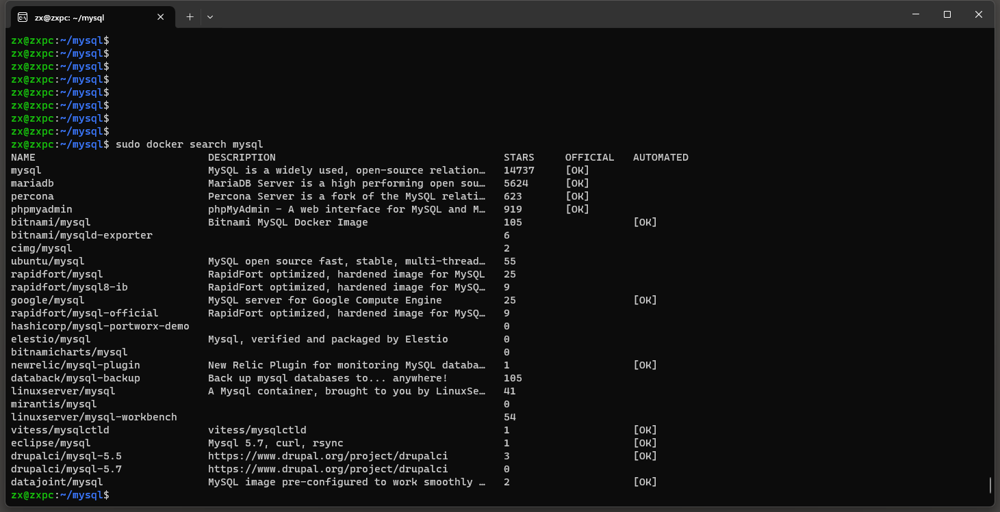
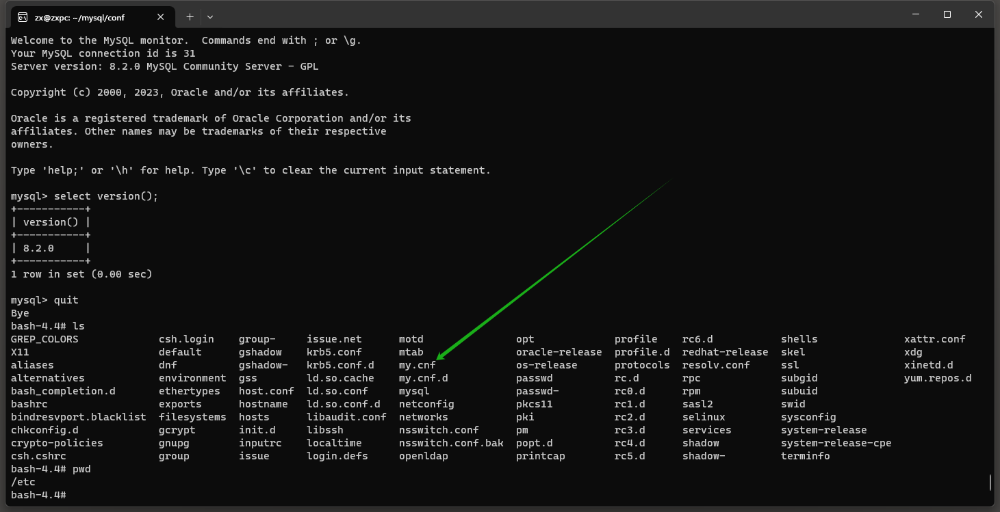
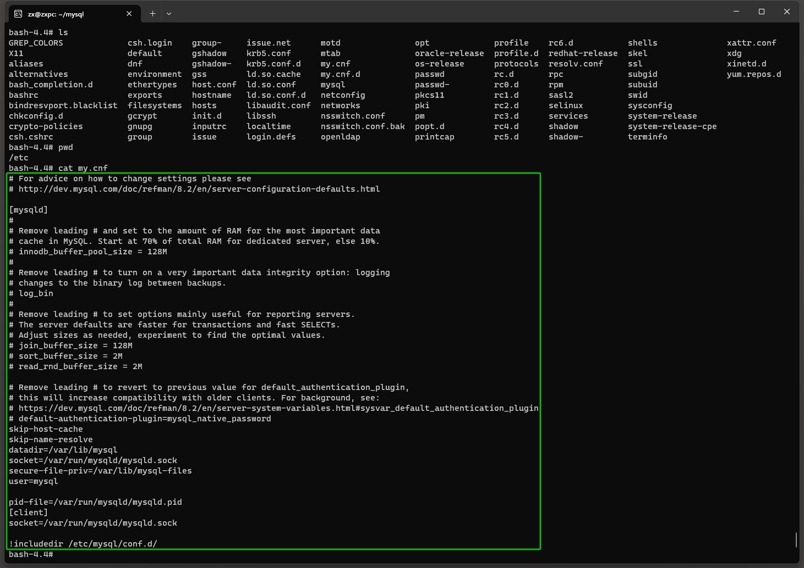

# Docker安装MySQL8.2.0
**2024-01-01**
***

查一下MySQL镜像


准备一些文件夹做挂载
```shell
mkdir /home/zx/mysql/conf
mkdir /home/zx/mysql/data
mkdir /home/zx/mysql/log
mkdir /home/zx/mysql/mysql-files
```

拉取镜像
```shell
sudo docker pull mysql
```

先随便创建一个临时容器，因为我们要拿配置文件，用于挂载。
```shell
sudo docker run -d --name mysql -p 3306:3306 -e MYSQL_ROOT_PASSWORD=adminadmin mysql
```

进入临时容器
```shell
sudo docker exec -it mysql /bin/bash
```

找一下配置文件```my.cnf```
```shell
cd etc
ls
```



```shell
cat my.cnf
```
全选复制```ctrl + insert```


退出到容器外
```shell
quit
```

手动粘贴```shift + insert```刚找到的文件到容器外(vim怎么保存自己查一下......)
```shell
sudo vim /home/zx/mysql/conf/my.cnf
```

停掉并删掉这个临时容器
```shell
sudo docker stop mysql
sudo docker rm mysql
```

创建我们真正想要的容器
```shell
sudo docker run -d -p 3306:3306 --restart=always --name mysql --privileged=true -v /home/zx/mysql/log:/var/log/mysql -v /home/zx/mysql/data:/var/lib/mysql -v /home/zx/mysql/conf/my.cnf:/etc/my.cnf -e MYSQL_ROOT_PASSWORD=adminadmin mysql --lower-case-table-names=1
```

查看服务状态
```shell
sudo docker ps
```