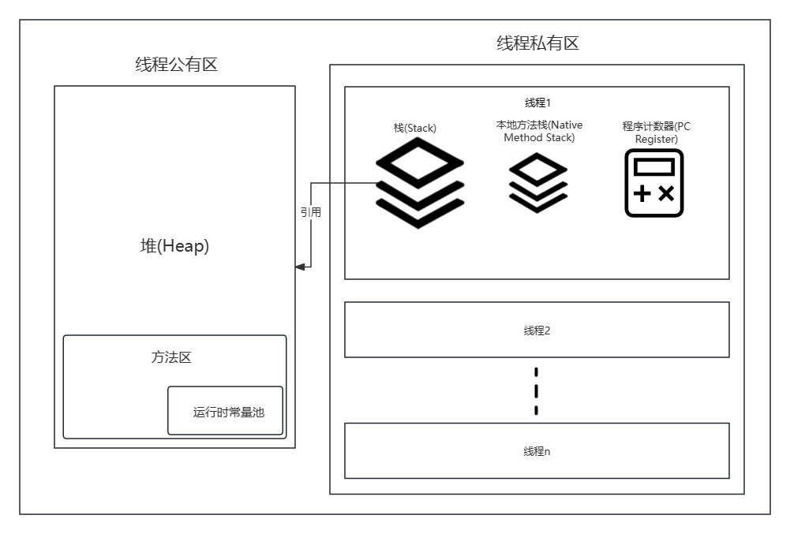

## JVM内存模型解析


堆：存储对象
栈：存储基础数据类型(如：boolean,byte,char...)和对堆中对象的引用
方法区：存储常量池和每个类的结构、方法、字段等元数据信息

堆和方法区是线程公有的
栈是线程私有的

## Java栈模型解析


Java栈测试用例

```auto
public class Demo {
    public static void main(String[] args) {
			test();
		}

    public static void test() {
        int i = 2;
				int j = 3;
				int k = i * j;
				System.out.println(k);
		}
}
```

编译后得到的Class文件（JVM指令）

```auto
Compiled from "Demo.java"
public class Demo {
  public Demo();// 无参构造
    Code:
       0: aload_0
       1: invokespecial #1                  // Method java/lang/Object."<init>":()V
       4: return

  public static void main(java.lang.String[]);
    Code:
       0: invokestatic  #2                  // Method test:()V
       3: return

  public static void test();
    Code:
       0: iconst_2    // 将int类型的2推送至栈顶
       1: istore_0    // 将栈顶int型数值存入第一个本地变量
       2: iconst_3    // 将int类型的3推送至栈顶
       3: istore_1    // 将栈顶int型数值存入第二个本地变量
       4: iload_0     // 将第一个int型本地变量推送至栈顶
       5: iload_1     // 将第二个int型本地变量推送至栈顶
       6: imul        // 将栈顶两int型数值相乘并将结果压入栈顶
       7: istore_2    // 将栈顶int型数值存入第三个本地变量
       8: getstatic     #3                  // Field java/lang/System.out:Ljava/io/PrintStream;
      11: iload_2     // 将第三个int型本地变量推送至栈顶
      12: invokevirtual #4                  // Method java/io/PrintStream.println:(I)V
      15: return
}
```

## 堆内存模型GC解析


1.  年轻代满后执行轻GC，没被GC掉的对象进入From区

2.  From区满后进行第二次轻GC，第二次还是没被GC的进入To区

3.  To区满了后，To区变成From区，From区变成To区，然后在此时的From区进行第三次轻GC

4.  步骤3中From区和To区循环转换，每次GC会给当前对象年龄+1，直到年龄=15（默认15，可修改）时还没死，该对象会被放入老年代

5.  老年代中的对象只能进行Full GC

堆内存空间占用比例：

新生代：1 / 3 (Eden + From + To)

老年代：2 / 3

### Minor GC & Full GC

1.  Minor GC
    
    又称新生代GC，只发生在新生代的垃圾收集动作。
    
    因为Java对象大多朝生夕灭，所以Minor GC非常频繁，一般回收速度也很快。
    

2.  Full GC
    
    又称Major GC或老年代GC，指发生在老年代的GC。
    
    出现Full GC经常会伴随至少一次的Minor GC（不是绝对，Parallel Sacvenge收集器就可以选择设置Major GC策略）。
    
    Major GC一般比Minor GC慢10倍以上。
    

JVM调优标准：

降低Full GC的执行时间

降低Full GC的执行频率

用JDK自带的jconsole执行手动GC不会进入幸存者区

关于Minor GC / Major GC / Full GC 的区别，网络众说纷纭，我也没搞清。