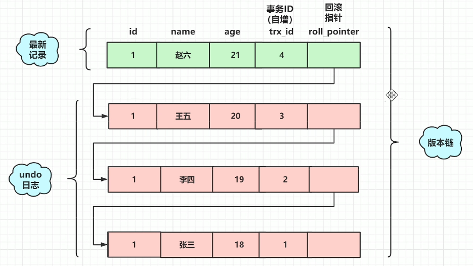
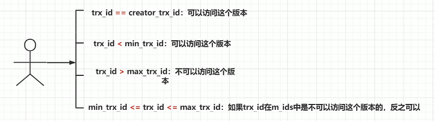

# MVCC实现原理
## 1. 什么是MVCC？
Multi-Version Concurrency Control 多版本并发控制，是在读取数据时不加锁来提高读取效率和并发性的一种手段。

MVCC解决的是读写时的<b>线程安全问题</b>。

MVCC中提到的读都是快照读，也就是普通的select。快照读不用加锁，不过可能读到历史数据。

除了快照读，还有当前读。当前读是给读取的数据加锁，所以读到的都是最新的。

<b>将MySQL调整为InnoDB引擎且为RC和RR级别时，MSQL快照读支持MVCC。</b>

## 2. MVCC实现原理
MVCC实现基于undolog、版本链、readview

### 2.1 MySQL会隐式地帮我们定义几个字段。
- trx_id:事务ID，每进行一次事务操作，就会自增1。
- roll_pointer:回滚指针，用于找到上一个版本的数据，结合undolog进行回滚。

### 2.2 什么是readview呢？

当我们用select读取数据时，这一时刻的数据会有很多个版本（例如上图有四个版本），但我们并不知道读取哪个版本，这时就靠readview来对我们进行读取版本的限制，通过readview我们才知道自己能够读取哪个版本。

### 2.3 判断可否读取的规则
| 字段             | 含义                       |
|----------------|--------------------------|
| m_ids          | 当前活跃（即未提交）事务的ID列表        |
| min_trx_id     | 当前最小的活跃事务ID              |
| max_trx_id     | 要分配给下一个事务的ID             |
| creator_trx_id | 生成该readview的事务ID，即当前事务ID |

1. 可以读这个版本，因为这就是读自己创建的记录。

2. 可以读这个版本，因为这说明当前事务已提交。

3. 不可以读这个版本，因为这说明当前事务不在版本链中。

4. 不可以读这个版本，因为这说明当前事务仍活跃，即未提交。

## 3. MVCC如何实现RC和RR的隔离级别
3.1 RC(Read-Committed)隔离级别下，每个快照读都会生成最新的readview。

3.2 RR(Repeatable-Read)隔离级别下，只有在同一个事务的第一个快照读才会创建readview，之后的每次快照读都使用的同一个readview，所以每次的查询结果都是一样的。

## 4. 幻读问题
<b>快照读</b>：通过MVCC，RR的隔离级别解决了幻读问题，因为每次使用的都是同一个readview。

<b>当前读</b>：通过next-key锁（行锁+gap锁），RR隔离级别并不能解决幻读问题。

---

学习于： [MVCC详解，深入浅出简单易懂](http://t.csdnimg.cn/hC8Pc)

做了适合于自己阅读的整理。